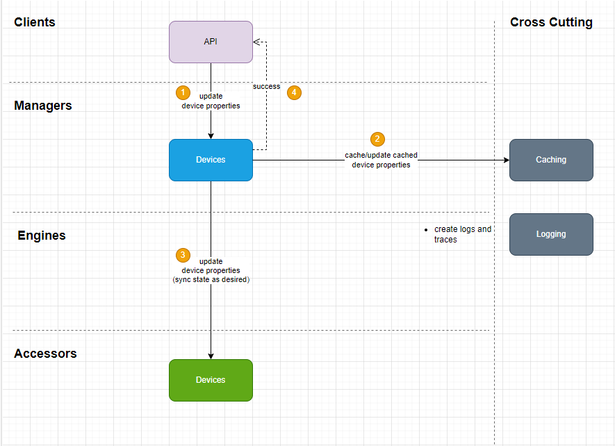

###### Team DroneValue
- Ilan Lavan: ilanlav@codevalue.com
- Nir Albo: niral@codevalue.com
- Open!
### 1-3: Diagrams
- Services

- Swim-lane 1: Querying device state

- Swim-lane 2: Controlling devices

- Swim-lane 3: Device sends telemetry

---
### 4: Proposed communication method
Since the system should be highly available, asynchronous communication fits better. Additionally, since the system should listen to messages from the devices (bottom to top), a message bus should be a good choice.

### 5: Database suggestion
Since the system shold be highly available, any database engine that's scalable and distributed (nodes, replicas etc.) should do the work. NoSQL should be a good choice.

### 6: Candidates for optimization by utilizing cache
- Registered devices properties/state
- Telemetry/analytics data

Caching these two would really improve the system performance and availability.